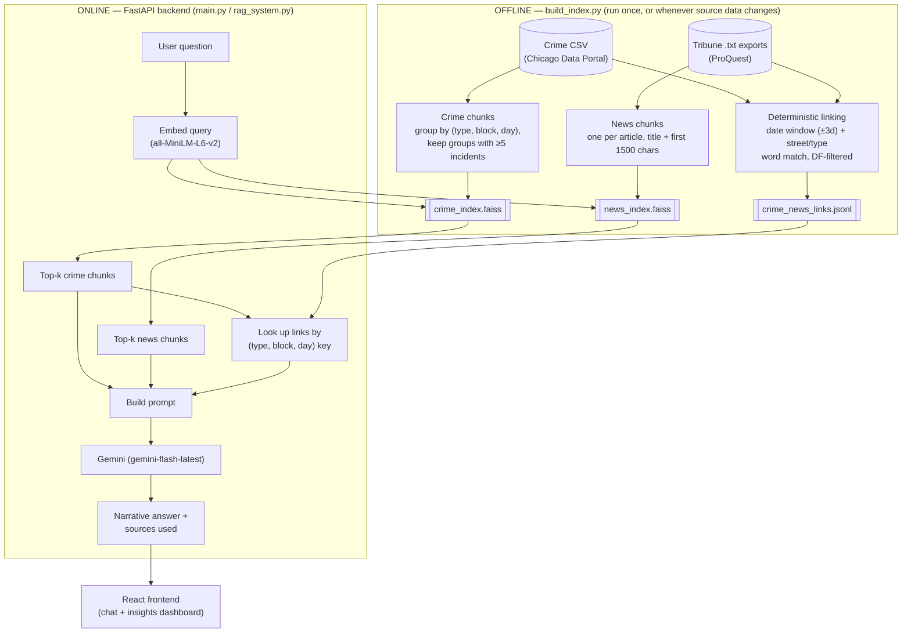

# Chicago Crime Narrative Intelligence

**🔗 Live app: [narrative-intelligence-rag.vercel.app](https://narrative-intelligence-rag.vercel.app/)** — open it and ask a question, no setup required. (Backend: `https://chicago-crime-backend.onrender.com`, kept warm by an UptimeRobot ping every 5 min.)

A hybrid RAG system over Chicago crime records (2018–present) and Chicago
Tribune news coverage. It retrieves matching crime-record chunks and news
articles for a question, deterministically cross-links crimes to articles
that plausibly cover them, and asks Gemini to synthesize a narrative answer.
Originally built as a notebook for IS597 (Group 6); this adds a FastAPI
backend + React frontend so it can be queried interactively, deployed for
anyone to try.

## Architecture

Two pipelines share one data model: an **offline build step** that turns raw
crime + news data into embeddings and a link index, and an **online API**
that only ever reads what the build step produced.



**Why two separate FAISS indices instead of one**: crime records and news
articles are structurally different documents (a terse stats summary vs. a
full article), so each gets its own index and its own top-k search; results
are combined only when building the final prompt, not embedded into one
shared vector space.

**Why a *separate* deterministic linking step, if retrieval is already
semantic**: FAISS similarity search can surface a crime chunk and a news
article that are topically related but never actually says a crime record
and an article are about *the same incident*. The linking step is a cheaper,
exact-match signal (same street, same crime type, published within days of
the incident) that the LLM is told to treat as a confirmed cross-reference,
separate from the "these seem semantically similar" signal FAISS provides.

**Request lifecycle for one question** (`POST /ask`):
1. Embed the question with the same sentence-transformer used to build the
   indices
2. Search `crime_index.faiss` and `news_index.faiss` independently for top-k
   matches
3. For each retrieved crime chunk, look up any links keyed to that exact
   `(crime type, block, day)` — not a generic slice of the links file
4. Stuff crime chunks + news chunks + matched links into one prompt, sent to
   Gemini
5. Return the generated answer alongside the raw retrieved chunks/links, so
   the frontend can show its work

### Components

| File | Responsibility |
|---|---|
| `backend/build_index.py` | Offline: parses raw CSV + ProQuest `.txt` exports, builds chunks, runs the linking algorithm, builds both FAISS indices. Never runs as part of serving traffic. |
| `backend/rag_system.py` | Online: loads the cache once at startup; `NarrativeRAGSystem.rag_query()` does retrieval + link lookup; `NarrativeChatbot.ask()` builds the prompt and calls Gemini; `_compute_analytics()` aggregates chunk metadata for the dashboard. |
| `backend/main.py` | FastAPI app — `GET /health`, `GET /stats`, `GET /analytics`, `POST /ask`. Thin routing layer only; no business logic lives here. |
| `frontend/src/App.jsx` | Two-state UI: a centered landing input (no messages yet) that transitions to a top-down scrolling chat once a conversation starts. |
| `frontend/src/components/Sidebar.jsx` | Live stats tiles + `/analytics`-driven insights (top crime types, most-flagged blocks, trending coverage topics) + example prompts. |
| `frontend/src/components/SourcesPanel.jsx` | Renders the actual retrieved crime records / news articles / links per answer, so the retrieval step is inspectable, not a black box. |
| `frontend/src/api.js` | One `API_BASE` constant — `/api` locally (proxied by Vite to the backend), or `VITE_API_URL` (the deployed backend's full origin) in production. |

### Tech stack

- **Embeddings**: `sentence-transformers` (`all-MiniLM-L6-v2`), CPU-only `torch`
- **Vector search**: `faiss-cpu` (flat L2 index — exact search, no ANN needed at this scale)
- **Generation**: Google Gemini (`gemini-flash-latest`) via `google-generativeai`
- **Backend**: FastAPI + Uvicorn
- **Frontend**: React + Vite + Tailwind CSS v4, `react-markdown`, `lucide-react` icons
- **Data processing**: pandas / numpy

## Layout

```
backend/                FastAPI server + RAG pipeline
  build_index.py           offline step: raw data -> cache/ (chunks + FAISS indices)
  rag_system.py             online step: serves retrieval + Gemini generation + analytics
  main.py                   FastAPI app (GET /health, /stats, /analytics, POST /ask)
frontend/                React + Vite + Tailwind chat UI + insights dashboard
data/sample/             small bundled slice of crime + news data (see below)
cache/                    generated by build_index.py — gitignored
render.yaml              Render Blueprint (backend)
frontend/vercel.json     Vercel build config (frontend)
Final_Crime_Analysis_Narrative_Intelligence.ipynb   original pipeline notebook
Final_Machine_Learning_Crime_Analysis.ipynb         EDA / ML notebook (separate from the RAG system)
```

## About the data

- **Crime data**: `Crimes_2018_to_Present.csv` (~516MB, ~1.9M rows) from the
  Chicago Data Portal. Too large for git — not included. A ~50K-row sample
  (Aug 31–Nov 15, 2025) ships in `data/sample/Crimes_sample.csv` so the app
  runs out of the box.
- **News data**: `Chicago Tribune Data/*.txt`, ProQuest exports accessed via
  a library subscription — licensed content, not included in full. One
  overlapping export (`data/sample/Chicago Tribune Data/`) is bundled for
  the same Aug–Nov 2025 window as the sample crime data, so retrieval and
  linking actually find matches.
- **cache/**: chunked text + FAISS indices generated from the above by
  `build_index.py`. Regenerated locally, never committed (it can run past
  100MB even for the small sample, and is fully reproducible from data + code).

To run against the **full** dataset instead of the sample: place
`Crimes_2018_to_Present.csv` and `Chicago Tribune Data/` in the project root
(both are gitignored, so this is safe) and pass their paths to
`build_index.py` (see below). Takes about 19 minutes end to end on the full
1.9M-row dataset — dominated by embedding 15K news articles, not the linking
step (see Known issues). The live deployment runs on the small sample, not
the full dataset.

## Running it locally

### 1. Backend

```bash
cd backend
pip install -r requirements.txt
cp .env.example .env        # then put a real GEMINI_API_KEY in .env
python build_index.py       # builds cache/ from data/sample/ (a few minutes)
uvicorn main:app --reload   # http://127.0.0.1:8000
```

Get a free Gemini API key at https://aistudio.google.com/apikey. Never commit
`.env` — it's gitignored already.

To build against the full dataset instead:

```bash
python build_index.py --crime-csv "../Crimes_2018_to_Present.csv" --news-dir "../Chicago Tribune Data"
```

### 2. Frontend

```bash
cd frontend
npm install
npm run dev                 # http://localhost:5173
```

The dev server proxies `/api/*` to `http://127.0.0.1:8000`, so start the
backend first. Ask a question in the chat UI — it shows the generated
answer plus the retrieved crime records, news articles, and links used, and
the sidebar shows live insights (top crime types, most-flagged blocks,
trending coverage topics) pulled from `/analytics`.

## Deployment: Vercel (frontend) + Render (backend), both free tier

**Live**: frontend at [narrative-intelligence-rag.vercel.app](https://narrative-intelligence-rag.vercel.app/),
backend at `chicago-crime-backend.onrender.com`.

Split across two platforms because they suit each half differently:
Vercel is purpose-built for static frontends (fast, zero-maintenance, no
spin-down); Render runs the backend as a normal long-lived process, which
Vercel's Python serverless functions can't do at all — they cap deployment
size at 50MB, and `torch` alone is 150-800MB.

### Backend -> Render

`render.yaml` at the repo root is a [Render Blueprint](https://render.com/docs/blueprint-spec).
Apply it from the Render dashboard (New -> Blueprint, point it at this repo)
or set it up manually:
- Root directory: `backend/`
- Build command: `pip install -r requirements.txt && python build_index.py`
  (builds `cache/` from the bundled `data/sample/` during the build step,
  since Render's free-tier disk doesn't persist across deploys)
- Start command: `uvicorn main:app --host 0.0.0.0 --port $PORT`
- Env vars: `GEMINI_API_KEY` (your key, marked secret), `FRONTEND_ORIGIN`
  (set once the Vercel URL exists, for CORS)
- `backend/.python-version` pins Python 3.11.9 (not the 3.14 used in local
  dev) since 3.11 has guaranteed `faiss-cpu`/`torch` wheels on Linux.
- `requirements.txt` pins `torch` to the CPU-only build via
  `--extra-index-url https://download.pytorch.org/whl/cpu` — pip's default
  Linux wheel for `torch` bundles full CUDA support (several GB of unused
  `nvidia-*` packages), which both blew up the build time (~19 min) and
  contributed to an out-of-memory crash on the 512MB free tier. The CPU-only
  build fixed both.

**Memory**: Free and Starter Render web services both cap at 512MB RAM. This
backend's actual resident memory measured locally on Windows was only
~120MB at idle, but the real Linux deploy still OOM'd — until the CUDA
torch build was swapped for the CPU-only one (see above). With that fix, the
free tier runs it reliably.

**Cold starts**: free-tier services sleep after 15 minutes of inactivity;
waking one up re-imports `torch`/`sentence-transformers` and reloads the
model on a throttled 0.1 vCPU, which took 3-4 minutes in practice — much
longer than Render's usual "30-60 second" cold-start estimate for lighter
apps. Fixed by pinging `/health` every 5 minutes from a free
[UptimeRobot](https://uptimerobot.com) monitor so the service never crosses
the idle threshold. (Upgrading to Render's Starter tier, $7/mo, would remove
the sleep entirely as a paid alternative.)

### Frontend -> Vercel

`frontend/vercel.json` pins the framework/build settings. In the Vercel
dashboard: New Project -> import this repo -> set **Root Directory** to
`frontend` -> set env var `VITE_API_URL` to the backend's Render URL (no
trailing slash) -> Deploy.

### One-time URL fixup

Both platforms only assign a real URL after the first deploy:
1. Deploy the backend on Render, copy its URL.
2. Deploy the frontend on Vercel with `VITE_API_URL` set to that URL.
3. Copy the Vercel URL, set it as `FRONTEND_ORIGIN` on the Render backend,
   and let it redeploy.

### Full dataset

To deploy against the full dataset instead of the sample, either upgrade to
a Render disk (persistent storage) and adjust the build command's
`build_index.py` flags, or build `cache/` locally and upload it some other
way — the free-tier build step doesn't have the raw 516MB CSV to work with.

## Known issues / notes for whoever picks this up

- The deterministic crime↔news linking (`build_links` in `build_index.py`)
  requires a street-name word AND a crime-type word to both appear in an
  article, restricted to words specific enough to be useful (a word is only
  used as a street match if it appears in under 3% of all articles — filters
  out streets that are also common words, like "State" or "Chicago" itself,
  or "May" the month). Even so it's still substring/word matching, not true
  entity resolution — a real version would want named-entity/geocoding-based
  matching instead.
- `rag_query` only returns links tied to the crime chunks actually retrieved
  for that query (via a `(type, block, day)` index), not an arbitrary slice
  of the links file — this matters because the file itself is a flat log of
  every match found, unordered by relevance.
- The original notebook's `pd.to_datetime(...)` call on the news
  `PublicationDateRaw` column (no `format=`) silently failed to parse most
  dates under pandas 3.x — pandas infers a format from the first value and
  NaTs anything that doesn't match it exactly, even though the strings are
  all the same `"Mon D, YYYY"` format. Fixed here with `format="mixed"`.
  Worth knowing if you see this pattern elsewhere in the codebase.
- Only crime chunks with ≥5 incidents on the same (type, block, day) get
  embedded — on the full dataset that's ~500 chunks out of 1.9M rows, so
  the crime side of retrieval is sparse by design.
